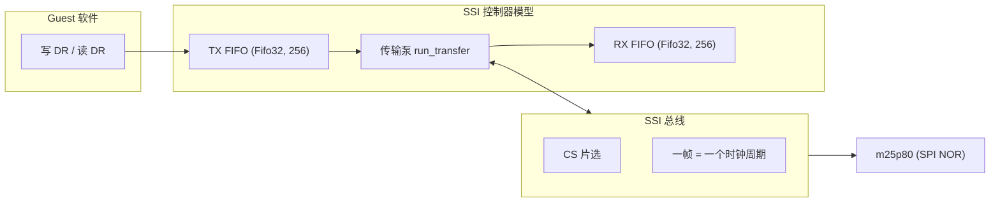
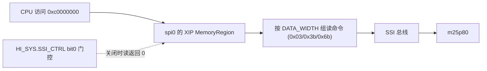

# QEMU 训练营 2026 项目阶段：从 IOMUX 到 K230 的 SPI/QSPI 建模

!!! note "主要贡献者"

    - 作者：[@flamboyante](https://github.com/flamboyante)

---

> K230 外设建模项目阶段总结（2026 年 7 月 \~ 8 月）。

这段工作分成两部分。先是 IOMUX：它只是一个引脚配置寄存器块，没有中断、DMA 或数据收发，却足够让我完整走一遍上游流程：发补丁、接收评审、拆分补丁、补测试。做到 SPI 时，这套流程已经不再陌生。

另一部分是 SPI/QSPI。三个控制器恰好使用同一个 DesignWare SSI IP，一套模型可以覆盖三个实例；工作从标准 PIO 延伸到 QSPI、IDMA 和 XIP，最终让 U-Boot 从 Flash 读取 Linux 并启动。

下面记录其中几次改变实现方向的排查，以及它们留下的边界。

## 1. 项目介绍

### 1.1 项目开始前：K230 在 QEMU 主线长什么样

K230 是 Canaan 的 AIoT SoC，包含两个 RISC-V 计算核和一个 KPU。项目开始前，QEMU 主线已经有 `-machine k230` 这台机器，文档的 Supported devices 列表只有以下几项：

```text
* 1 c908 cores (little core)
* Core Local Interruptor (CLINT)
* Platform-Level Interrupt Controller (PLIC)
* 2 K230 Watchdog Timer
* 5 UART
```

其余外设虽然有地址窗口，但仍是 `create_unimplemented_device()` 占位，读写没有实际设备行为。当时 `hw/riscv/k230.c` 中这类占位共有 53 个：启动链上的 CMU、RMU、IOMUX、BootROM、DDRC，存储相关的 SD、SPI、QSPI，外设侧的 GPIO、I2C、PWM，以及 PMU、PWR 等。

启动方面，机器支持 SDK U-Boot M-mode 启动，也支持 direct Linux boot。

平时写 Linux 或 U-Boot 驱动时，我们站在外设使用者的角度：查 databook，确定寄存器含义，写配置、读状态、等中断，直到事务结束。驱动默认这些寄存器、状态位和中断线会按约定工作；出问题时，通常只能向芯片原厂提交 case。

到了 QEMU 外设建模，视角正好反过来：模型成了 IP 的内部实现。驱动写的每一笔配置、读到的每一个状态、等待的每一次中断，都必须由代码给出符合预期的行为。

### 1.2 任务： issue

训练营仓库里的 K230 issue 正好对应这批占位设备。目标是逐步将它们替换成有实际行为的模型，满足 SDK 中 U-Boot 和 Linux 驱动的最小功能契约。

按功能分组大致是这样：

| 组   | 子 issue                                      | 当时状态         |
| --- | -------------------------------------------- | ------------ |
| 基础  | #2 CPU、#6 PLIC、#7 CLINT                      | 已有实现/复用，多为补强 |
| 初始化 | #3 DDRC、#5 BootROM、#10 CMU、#11 RMU、#12 IOMUX | 占位           |
| 存储  | #13 SD、#14 QSPI、#15 Flash window、#18 SPI     | 占位           |
| 外设  | #16 GPIO、#17 I2C、#19 Timer、#20 RTC           | 占位           |
| 电源  | #21 PMU、#22 PWR、#23 HI\_SYS                  | 占位           |
| 其他  | #24 Mailbox、#25 DMA、#26 GSDMA                | 占位           |

当时 #8 UART、#11 RMU 已经有人认领了，其余基本是开放的。

### 1.3 我的切入点

我先从 IOMUX 入手。它是最简单、边界最清楚的寄存器块，虽然对启动链的直接价值有限，但适合用来完成一次完整的上游贡献流程。之后再继续处理 SPI、QSPI、HI\_SYS 和 Flash window。

## 2. IOMUX：最简单的外设，最完整的流程

### 2.1 它是什么

IOMUX 负责"引脚配置"这一环：某个 pin 选哪个功能、要不要上拉、驱动能力多大。

??? note "为什么外设需要 IOMUX"

    真实 SoC 上一个外设要工作，通常不只靠外设自己的寄存器：RMU 解除 reset、CMU 打开 clock、IOMUX 把相关引脚配成对应功能，最后才是外设控制器本身。IOMUX 是启动链和外设 probe 的前置配置之一。

    K230 将它单独列为一种外设，而不少 SoC 会将这类配置放在 GPIO 中。它有 64 个 pin 配置寄存器，每个对应一个物理管脚，reset 值可从 U-Boot 和 TRM 对照得到。

实现本身不复杂：寄存器数组、读写回调、复位值和可写掩码即可。QEMU 中不模拟电气特性，引脚电平也没有 Guest 可观察的消费者；第一版因此只做寄存器兼容，将 `0x91105000..0x911057ff` 从 `create_unimplemented_device()` 替换为可读写、可复位的寄存器 bank。

### 2.2 U-Boot dts 的证据

为确认 IOMUX 的实际使用方式，我检查了 SDK U-Boot 的 DTS。`k230.dtsi` 中声明了节点：

```dts
iomux: iomux@91105000 {
    compatible = "pinctrl-single";
    reg = <0x0 0x91105000 0x0 0x800>;
    #pinctrl-cells = <1>;
    pinctrl-single,register-width = <32>;
    pinctrl-single,function-mask = <0xffffffff>;
};
```

板级 `k230_evb.dtsi` 里直接按 `<offset, value>` 配引脚：

```dts
pins: iomux_pins {
    u-boot,dm-pre-reloc;
    pinctrl-single,pins = <
        /* BOOT */
        (IO0) (1<<SEL | 0<<SL | BANK_VOLTAGE_IO0_IO1 <<MSC | 1<<IE | 0<<OE | 1<<PU | 0<<PD | 2<<DS | 0<<ST)
        (IO1) (1<<SEL | 0<<SL | BANK_VOLTAGE_IO0_IO1 <<MSC | 1<<IE | 0<<OE | 1<<PU | 0<<PD | 2<<DS | 0<<ST)
        /* JTAG */
        (IO2) (1<<SEL | 0<<SL | BANK_VOLTAGE_IO2_IO13 <<MSC | 1<<IE | 0<<OE | 0<<PU | 1<<PD | 4<<DS | 1<<ST)
        ...
    >;
};
```

也就是说 U-Boot 的 `pinctrl-single` 驱动会做 32 位读改写，写完希望值能读回来——寄存器保存语义就够了。

### 2.3 实现前后的对比：从 unimplemented 日志到 U-Boot smoke test

实现前，U-Boot 一跑，`-d unimp` 日志里刷一堆：

```text
unimp: unimplemented device write 0x91105000 (size 4)
unimp: unimplemented device write 0x91105004 (size 4)
...
```

实现后，启动 U-Boot 并确认出现 `K230#` 提示符：

```bash
qemu-system-riscv64 -machine k230 -bios u-boot.bin -nographic
```

到 `K230#` 后，抓的 log 里没有 iomux 的访问告警，说明 guest 访问到这边，建模生效了。配套的验证有 qtest、WDT 回归和 U-Boot smoke test（起机到 `K230#`）。

### 2.4 上游 review：拆补丁 + 位级掩码

RFC v1 发出后，Alistair 和 Chao 都给了具体反馈。这次评审直接影响了后续 SPI 系列的补丁边界和寄存器掩码处理。

**Alistair Francis**：

1. 拆成三个补丁——设备模型、SoC 集成、qtest 覆盖，每个独立编译独立测试；
2. 别在 read/write 回调里手写 offset/size/alignment 检查，MemoryRegion 的 `.valid`/`.impl` 约束已经保证；
3. MMIO 窗口保留 0x800 字节，但只建模有文档的 64 个寄存器。

**Chao Liu**：寄存器不能把所有 32 位当普通可写存储——bit 31（`DI`，引脚输入状态）只读，bits 30-14 保留只读，只有 bits 13-0 可读写。v2 要按位权限做掩码：

```text
bit 31      DI        只读（引脚输入状态）
bits 30-14  reserved  只读
bits 13-0   配置字段   可读写
writable mask = 0x00003fff
```

<br />

!!! note "这次评审留下的习惯"

    - "拆补丁"的习惯——后面 SPI 的补丁拆分就是从这条 feedback 长出来的；
    - "每个寄存器的可写位单独确认，不一把梭"——后面 SPI 的 mask 表一直在用；

## 3. SPI：标准 PIO

### 3.0 为什么选这条线

选择 SPI/QSPI 建模主要有两个原因：

1. **补上启动链的空缺**：当时 K230 的镜像基本由 Host 直接装入 RAM，从存储介质启动的路径为空。K230 支持从 SPI NOR Flash 启动，U-Boot 也需要通过 SPI 将后续镜像读入内存，因此 SPI 建模的目标是补齐这条启动路径。
2. **一次建模覆盖三个实例**：SPI 和 QSPI 原本是两个独立 issue，但 TRM 显示三个控制器使用同一个 Synopsys DesignWare SSI IP。一套模型可以覆盖三个实例，因此可以合并实现。

三个实例能力不一样，但寄存器布局是同一套：

| 实例   | MMIO 地址      |           能力 | num-cs | 有 XIP |
| ---- | ------------ | -----------: | -----: | ----- |
| spi0 | `0x91584000` | SPI/QSPI/OPI |      1 | 是     |
| spi1 | `0x91582000` |        QSPI0 |      5 | 否     |
| spi2 | `0x91583000` |        QSPI1 |      5 | 否     |

### 3.1 模型骨架是怎么搭出来的

实现前先完成三项准备：根据 TRM 梳理寄存器组和数据通路，检查 QEMU 现有 SPI 模型的架构，并确认 SSI 总线抽象的使用方式。

第一步是翻 TRM 12.3 章，把寄存器清单理出来：`CTRLR0`、`CTRLR1`、`SSIENR`、`SER`、`BAUDR`、`TXFTLR`/`RXFTLR`（FIFO 阈值）、`TXFLR`/`RXFLR`（FIFO 当前深度，动态变化）、`SR`（状态）、`IMR`/`ISR`/`RISR`（中断屏蔽/状态/原始状态）、`*ICR`（中断清除，读清零）、`DR0..DR35`（数据 FIFO 入口）。先让这些寄存器能读能写、复位值对、mask 对，传输逻辑后面再补。

随后梳理数据通路：写 `DR` 进入 TX FIFO，传输泵将数据发至总线，返回数据进入 RX FIFO，再由读 `DR` 取走：



第二步是搞懂 QEMU 的 SSI 总线抽象，这是 SPI 控制器和 Flash 模型之间的接口层。QEMU 在 `include/hw/ssi.h` 里定义了：

- `TYPE_SSI_BUS` 是总线，挂在 master 设备下；
- `TYPE_SSI_SLAVE` 是从设备接口，m25p80（SPI NOR Flash 模型）就继承它；
- master 调用 `ssi_transfer(SSI_SLAVE(cs), value)` 给选中的片选发一帧，slave 在自己的 `transfer` 回调里返回对应字节。

一次 `ssi_transfer()` 对应一个时钟周期，master 推一个字节出去同时收一个字节回来，是**事务级抽象，不模拟 SCLK/CS 波形**，对 SPI NOR 这种只关心字节流的设备完全够用。

FIFO 用 QEMU 自带的 `Fifo32`，容量 256。这里有个容易踩的坑：`DR0` 到 `DR35` 这 36 个 MMIO 地址共享同一对 TX/RX FIFO，不管读写哪个偏移都要落到同一个 FIFO 入口，不能各自独立。

第三步是参考 QEMU 里现有的 SPI 模型学架构。QEMU 树里没有可直接照抄的 DWC APB SSI 模型，主要借鉴「阶段机 + FIFO pump」的写法：

| 参考模型                                        | 借鉴点                                      |
| ------------------------------------------- | ---------------------------------------- |
| `sifive_spi.c` / `pl022.c` / `xilinx_spi.c` | 最朴素的逐帧泵：pop TX → ssi\_transfer → push RX |
| `ibex_spi_host.c`                           | 用剩余帧数控制传输长度的状态机写法                        |
| `xlnx-versal-ospi.c`                        | 读 Flash 时自动填 0 产生读时钟的思路                  |
| `xilinx_spips.c`                            | command/address/dummy 多阶段状态机结构           |
| `designware_i2c.c`                          | Synopsys IP 做通用层拆分的先例                    |

DWC SSI 和普通 SPI 控制器有个关键区别：普通控制器需要驱动自己发 dummy 字节产生读时钟，而 DWC SSI 的 EEPROM\_READ 等模式靠 `CTRLR1.NDF`（Number of Data Frames）让硬件自动走完 dummy 阶段进入数据期。所以模型里需要自己实现 `phase + remaining_frames` 的状态机，不能直接照搬其他控制器的行为。

### 3.2 四种 TMOD 模式

`CTRLR0[11:10]` 叫 TMOD（Transfer Mode），决定一次 SPI 事务的方向。TRM 给了四种模式，光看寄存器手册不太容易搞清楚软件实际怎么用，对照 U-Boot 的 `designware_spi.c` 和 Linux 的 `spi-dw-core.c` 才对上号：

| TMOD | 名称                     | 方向           | RX 帧数怎么决定          | 谁在用                        |
| ---- | ---------------------- | ------------ | ------------------ | -------------------------- |
| 0    | TR（Transmit & Receive） | 全双工          | TX FIFO 发多少，RX 回多少 | 通用 SPI 读写，TX/RX 都有数据       |
| 1    | TO（Transmit Only）      | 只发不收         | 不产生 RX 数据          | 写 Flash（Page Program）、发命令  |
| 2    | RO（Receive Only）       | 只收不发         | `CTRLR1.NDF + 1`   | 纯数据接收，需一个 dummy 帧启动        |
| 3    | EEPROM\_READ           | 先发命令/地址，再自动收 | `CTRLR1.NDF + 1`   | **spi-mem 读操作（含 Read ID）** |

四种模式的核心区别在传输泵怎么处理 RX 帧。TR 和 TO 比较直观：TR 逐帧从 TX FIFO pop，调 `ssi_transfer()` 发出去，返回值 push 进 RX FIFO；TO 只发不收，pop 完就结束。

RO 和 EEPROM\_READ 不一样——它们需要硬件在命令/地址发完后**自动产生接收时钟**，软件不会再往 TX FIFO 里写 dummy 字节。具体来说：

- **RO**：写一个 dummy 帧进 TX FIFO 启动传输，之后硬件自动发出 `NDF+1` 个时钟收数据，软件只需要 poll RXFLR 然后读 DR。
- **EEPROM\_READ**：往 TX FIFO 写命令（和地址，如果有的话），硬件发完命令/地址阶段后自动切到接收阶段，收 `NDF+1` 帧数据。这是 spi-mem 框架读 Flash 时用的标准路径。

初版只实现了 TR 和 TO，RO 与 EEPROM\_READ 被留到后续。挂上 Flash 启动 U-Boot 后，系统卡在 `spi_nor_read_id()`，RXFLR 始终为 0。

寄存器 trace 如下：

```text
CTRLR0 = 0x00000c07  -> TMOD[11:10] = 3 (EEPROM_READ)
CTRLR1 = 0x00000005  -> NDF = 5，即 NDF+1 = 6 个接收帧
SSIENR = 0x00000001  -> 控制器已启用
SER    = 0x00000001  -> CS0 已选中
RXFLR  = 0x00000000  -> RX FIFO 永远是空的
```

U-Boot 的 spi-mem 路径读取 JEDEC ID 时只向 DR 写入一个 `0x9f`（Read ID 命令），随后轮询 RXFLR 等待 6 个字节。Guest 不会继续写入 5 个 dummy 字节；真实硬件会在命令阶段结束后自动产生后续时钟来接收数据。初版模型只在 DR 写入时触发一次 `ssi_transfer()`：发出 `0x9f` 后便停止，后续没有 MMIO 写入触发剩余传输，因此 RXFLR 始终为 0。问题不在 Flash 的 ID 返回，而在控制器没有发出读取 ID 所需的后续时钟。

对照 U-Boot 驱动 `dw_spi_exec_op()` 里的选择逻辑就很清楚了：

```c
if (read)
    if (priv->spi_frf == CTRLR0_SPI_FRF_BYTE)
        priv->tmode = CTRLR0_TMOD_EPROMREAD;   // 标准单线读 -> EEPROM_READ
    else
        priv->tmode = CTRLR0_TMOD_RO;          // 双线/四线 -> RO
else
    priv->tmode = CTRLR0_TMOD_TO;              // 写操作 -> TO
```

单线读（包括 Read ID、Read Data、Read SFDP）全部走 EEPROM\_READ，NDF 设为 `data.nbytes - 1`，写完命令+地址+dummy 后调 `poll_transfer()` 轮询 RXFLR 收数据。所以传输泵必须实现 EEPROM\_READ 的两阶段状态机：先把 TX FIFO 里的命令/地址发完，然后自动发 `NDF+1` 帧 0x00 产生时钟，把 RX 数据收回来。RO 同理，只是命令阶段只有一个 dummy 帧。

### 3.3 挂 Flash：num-cs 的 SDK 内部不一致

Flash 挂接本身只需将 spi0 的 CS0 连接到 m25p80（SPI NOR Flash 模型）。但 SDK 内部对 `num-cs`（片选数量）的描述不一致：U-Boot DTS 与 Linux DTS 的值不同。

- U-Boot DTS 里 spi0/spi1/spi2 的 `num-cs` 是 `1/5/5`
- Linux DTS 里是 `1/1/1`

这不是功能 bug，更像两边 DTS 没有对齐——Linux 侧可能直接用了驱动默认值，没按 SoC 实际片选数量写。当前启动路径是 U-Boot → Linux，以 U-Boot 为准选了 `1/5/5`，Linux 侧靠驱动 probe 时动态探测。模型的 `num-cs` 属性按实际硬件实例能力配，不硬编码某一方 DTS 的值。

### 3.4 IRQ：动态水位中断

K230 DW SSI 共有 9 路中断接到 PLIC：TXE（TX FIFO 空）、RXF（RX FIFO 满/达阈值）、RXO（RX 溢出）、TXU（TX 欠载）、RXU（RX 欠载）、MST（多主机冲突）、DONE（传输完成）、AXIE（AXI/IDMA 错误）加一个总清。其实还有ssi ip理论还有不少其他的中断，不过鉴于k230只支持9路，于是我就按9路实现了。

中断这块返过一次工。TXE 和 RXF 是水位中断：TXE 表示 TX FIFO 里的数据量低于或等于阈值（TFT），可以继续喂数据；RXF 表示 RX FIFO 里的数据量超过阈值（RFT），需要读走。这两个中断**不能用缓存值**——每次中断状态计算时，都必须从 FIFO 实时读取当前深度，和阈值寄存器比较，现算出来：

```c
static uint32_t k230_dw_ssi_irq_raw_status(K230DwSsiState *s)
{
    uint32_t status = s->irq_latched;
    /* 从 FIFO 实时读深度，不能用 regs[] 里的缓存 */
    uint32_t tx_used = fifo32_num_used(&s->tx_fifo);
    uint32_t rx_used = fifo32_num_used(&s->rx_fifo);
    /* 阈值寄存器只取 TFT/RFT 字段，其他位是保留的 */
    uint32_t tx_threshold = FIELD_EX32(s->regs[R_TXFTLR], TXFTLR, TFT);
    uint32_t rx_threshold = FIELD_EX32(s->regs[R_RXFTLR], RXFTLR, RFT);

    if (tx_used <= tx_threshold) {
        status |= R_RISR_TXEIR_MASK;   /* TX FIFO 空水位：可以继续写 */
    }
    if (rx_used > rx_threshold) {
        status |= R_RISR_RXFIR_MASK;   /* RX FIFO 满水位：需要读走 */
    }
    return status & K230_DW_SSI_IRQ_VALID_MASK;
}
```

`s->irq_latched` 存的是事件型中断（RXO 溢出、TXU 欠载等），这些是边沿触发的事件，发生一次就锁存，读 ICR 清除。TXE/RXF 是电平型状态，每次算 RISR 都得现算，跟 FIFO 实际深度走。TXFLR/RXFLR 这两个 MMIO 寄存器也是同样道理——读的时候直接返回 `fifo32_num_used()`，不能从 `regs[]` 数组里返回缓存值。

### 3.5 验证：U-Boot 和 Linux 两侧对照

标准 PIO 的验证是让 U-Boot 从 SPI Flash 读取镜像并启动 Linux。下面按 U-Boot 驱动的行为对照模型响应。

**第一步：U-Boot 初始化 SPI 控制器**

U-Boot 驱动 `designware_spi.c` 里的初始化流程：

```c
/* U-Boot: dw_spi_set_bus_and_cs() / dw_spi_claim_bus() */
dw_write(priv, DW_SPI_SSIENR, 0);          /* 先禁用控制器 */
dw_write(priv, DW_SPI_CTRLR0, cr0);        /* 设帧格式、TMOD、时钟极性等 */
dw_write(priv, DW_SPI_BAUDR, clk_div);     /* 设波特率分频 */
dw_write(priv, DW_SPI_TXFTLR, 0);          /* TX 阈值设 0 */
dw_write(priv, DW_SPI_RXFTLR, fifo_len-1); /* RX 阈值设 FIFO 深度-1 */
dw_write(priv, DW_SPI_SER, 1 << cs);       /* 片选 */
dw_write(priv, DW_SSI_SSIENR, 1);          /* 启用控制器 */
```

QEMU 模型这边，每次写 `SSIENR=1` 时会复位内部状态（phase 回到 IDLE，清空 remaining\_frames），写 `SER` 时切换 active\_cs，写 `CTRLR0/BAUDR` 只是存进 regs\[]，传输泵在 DR 写入时才启动。

**第二步：读 JEDEC ID 探测 Flash（spi\_nor\_read\_id）**

这是 EEPROM\_READ 的典型用法。U-Boot 通过 spi-mem 调 `dw_spi_exec_op()`：

```c
/* U-Boot: dw_spi_exec_op()，读 JEDEC ID（0x9f） */
priv->tmode = CTRLR0_TMOD_EPROMREAD;       /* EEPROM_READ 模式 */
dw_write(priv, DW_SPI_CTRLR0, cr0);
dw_write(priv, DW_SPI_CTRLR1, 6 - 1);      /* NDF = 5，收 6 字节 */
dw_write(priv, DW_SSI_SSIENR, 1);
dw_writer(priv, &opcode_9f, 0, 1, ...);    /* 只写 0x9f 一个字节 */
poll_transfer(priv, NULL, rx_buf, 6);      /* 轮询 RXFLR，读 6 字节 */
```

QEMU 模型在 DR 写入时调用传输泵，识别到 TMOD=EEPROM\_READ：

```c
/* QEMU: k230_dw_ssi_run_transfer() EEPROM_READ 分支 */
case K230_DW_SSI_TMOD_EEPROM_READ:
    /* 命令阶段：把 TX FIFO 里的命令/地址发出去 */
    while (!fifo32_is_empty(&s->tx_fifo)) {
        uint32_t tx = fifo32_pop(&s->tx_fifo);
        k230_dw_ssi_send_frame(s, tx);      /* 0x9f -> ssi_transfer() -> m25p80 */
    }
    s->phase = K230_DW_SSI_PHASE_EEPROM_DATA;
    s->remaining_frames = FIELD_EX32(s->regs[R_CTRLR1], CTRLR1, NDF) + 1;
    /* 数据阶段：自动发 0x00 产生时钟，收 NDF+1 字节 */
    while (!fifo32_is_full(&s->rx_fifo) && s->remaining_frames > 0) {
        uint32_t rx = k230_dw_ssi_send_frame(s, 0x00);
        fifo32_push(&s->rx_fifo, rx);       /* m25p80 返回的 ID 字节进 RX FIFO */
        s->remaining_frames--;
    }
```

m25p80 收到 `0x9f` 后，后续每个时钟沿返回 JEDEC ID 字节（如 `0xef 0x40 0x19` 表示 Winbond W25Q256），这些字节通过 RX FIFO 回到 U-Boot，`sf probe` 就能识别出 Flash。

**第三步：读镜像启动 Linux**

识别出 Flash 后，U-Boot 用 `sf read` 命令从 Flash 读出 OpenSBI、Linux 内核、initrd、DTB 到内存，然后 `bootm` 启动：

```text
sf probe 0:0                              # 探测 CS0 上的 Flash
sf read 0x0c100000 0x0 0x14000           # 读 OpenSBI 到 0x0c100000
sf read 0x08200000 0x100000 0x1a1fe00    # 读 Linux 内核到 0x08200000
sf read 0x0a100000 0x1c00000 0x1eec20    # 读 initrd 到 0x0a100000
sf read 0x0a000000 0x1f00000 0x1000      # 读 DTB 到 0x0a000000
bootm 0x0c100000 - 0x0a000000            # 启动 Linux
```

Linux 侧启动后，`dw_spi_mmio` 驱动 probe，`spi-nor` 层识别到 w25q256，MTD 分区能做 erase/write/read 校验。这一串跑通了，标准 PIO 路径就算完成。

## 4. QSPI + IDMA：测着测着就绑定到一起了

### 4.1 为什么两个是一体的

QSPI 和 IDMA 原本计划分开实现，但检查 QSPI 路径后发现两者不能分离：**SDK 在总线宽度大于 1 时使用控制器内部 IDMA，而不是普通 PIO dummy**（`SPI_FRF != Standard` 时传输泵停止，由 IDMA 搬运数据）。因此 QSPI 验证必须包含 IDMA。

### 4.2 QSPI 四阶段事务

做 QSPI 前先理清楚一件事：普通 enhanced 模式下，一次事务不是简单地把字节推上总线，而是拆成**指令 → 地址 → dummy → 数据**四个阶段。每个阶段走几条线、多少位，由 `SPI_CTRLR0` 里的字段决定：

| 字段           | 含义                             |
| ------------ | ------------------------------ |
| `INST_L`     | 指令长度（0=不传，1=8 位，2=16 位，3=32 位） |
| `ADDR_L`     | 地址长度                           |
| `DATA_WIDTH` | 数据宽度（1/2/4/8 位）                |
| `WAIT`       | dummy cycles 数                 |

为什么会有 dummy 阶段？因为 Quad 读 Flash 时，数据阶段会从单线切到 4 线，总线切换需要几个空时钟让 Flash 跟上，同时 Flash 还需要 mode 字节来确认接下来走几线。这些时钟不携带数据，所以叫 dummy。

我们建模这边要做的，就是按这四个阶段依次往 SSI 总线发帧：先发指令、再发地址、再发 dummy 时钟、最后发数据（或收数据）。阶段之间靠 `phase` 状态区分，每个阶段走完再切下一个。

!!! bug "dummy cycles 的字节宽 vs 线宽（上游 m25p80 更新暴露的）"

    **现象**：rebase 到新 QEMU 基线后 qtest 红掉——`/qspi/dual-quad-output-read` 报 `actual != expected`。rebase 无冲突、构建也成功，纯粹是测试过不了。

    该问题由 QEMU 主线更新 m25p80 的 dummy-byte 换算后暴露：对 Winbond 等 Flash 的 `0x3b`/`0x6b` 读命令，8 个 dummy clocks 只应发送 1 个 SSI dummy byte。上游从设备模型修正后，控制器模型仍按旧契约发送。K230 qtest 对 `0x3b`/`0x6b` 设置 `SPI_CTRLR0.WAIT_CYCLES=8`；该字段单位是 dummy clock cycles，旧实现却将它直接当成 `ssi_transfer()` 次数，发送了 8 个 SSI 字节。

    多余的 7 个零字节会在 Flash 已进入数据阶段后消耗真实数据，使控制器读到偏移后的内容。根因是主、从设备模型对 dummy phase 的字节数约定不一致。

    **修法**：换算必须依据 dummy phase 宽度：`TRANS_TYPE=0`（1-1-2/4 output read）走单线 dummy phase；`TRANS_TYPE=1/2` 按 Dual/Quad 的 2/4 线宽计算，发送次数是 `ceil(WAIT_CYCLES * lines / 8)`。Quad I/O 的 mode byte 仍是独立字段，不能重复计入 dummy bytes：

    ```c
    static uint32_t k230_dw_ssi_dummy_bytes(uint32_t spi_frf,
                                             uint32_t trans_type,
                                             uint32_t wait_cycles)
    {
        uint32_t lines = 1;

        if (trans_type != 0) {
            lines = spi_frf == 1 ? 2 : 4;
        }

        return DIV_ROUND_UP(wait_cycles * lines, 8);
    }
    ```

    换算依据是这样的：`WAIT_CYCLES` 是**时钟周期**数，但 m25p80 模型按**字节**消化 dummy。1 个时钟周期在单线下传 1 位、双线下传 2 位、四线下传 4 位，所以要先乘线宽得到总位数，再除以 8 得到字节数。

    **教训**：rebase 后必须运行全量 qtest。构建成功不能证明主、从设备之间的事务契约仍然一致。

### 4.3 IDMA：同步还是异步

IDMA 是控制器自带的 AXI master，不是外接 DMA。异步方案可以复用 QEMU 的 stream 模型：master/slave 通过 `stream_push()`/`stream_can_push()` 表达 backpressure 和分块搬运；但 SDK 驱动的使用方式并不需要该行为：

??? note "SDK 驱动的 IDMA 用法"

    U-Boot 的 `designware_spi.c` 和 RT-Smart 的 `drv_spi.c` 都是**轮询 `DONE` 位**的：

    ```c
    /* 伪代码：SDK 驱动的 IDMA 使用方式，摘自 RT-Smart drv_spi.c */
    spi->dmacr = DMACR_IDMAE | DMACR_AINC | ...;
    spi->spi_ar = flash_offset;
    spi->axi_ar0 = dram_addr;
    spi->axi_awlen = length;
    spi->ser = 1 << cs;
    spi->ssienr = 1;
    /* 然后……就死等 DONE */
    rt_event_recv(..., BIT(SSI_DONE) | BIT(SSI_AXIE), ...);
    spi->ser = 0;
    spi->ssienr = 0;
    ```

软件会等待完成事件，因此 QEMU 的同步模型足够：写入 `SSIENR=1` 后一次性将数据从 Flash 搬入内存，再置 `DONE`。异步实现会增加 BH 和 backpressure 状态，但 Guest 无法观察到相应差异。

在 QEMU 里，DMA 是设备代替 CPU 访问 Guest 内存。不能直接 `memcpy`，因为 Guest 物理地址并不等于 Host 地址；必须经由 `dma_memory_read()`/`dma_memory_write()` 走 AddressSpace 翻译。

!!! note "什么时候该用 BH 异步"

    Bottom Half（`aio_bh_schedule`）适合模拟硬件后台传输、软件可以并行继续工作的场景。这里软件会等待 `DONE`，同步完成更贴合 Guest 可观察到的行为；额外引入 BH 和 backpressure 没有收益。

IDMA 也收过一次语义：

- **IDMA 使能时 DR 读写要拒绝**（PIO 和 IDMA 互斥，不能一边跑 DMA 一边写 FIFO）；
- **fixed-address IDMA 不支持**（`AINC=0` 只 LOG\_UNIMP 然后结束事务，不假装搬了）；
- **触发要求 FIFO 为空**。

!!! bug "DONECR 的 read-clear 语义（Linux Quad 组合验证才暴露）"

    **现象**：Linux 5.10.4 Quad 的 MTD write/read/cmp 测试失败。

    初版将寄存器清除语义实现错误。SDK Linux 驱动的 DONE IRQ handler 会**读取 `DONECR` 清除中断**（TRM 标为 RC：读取返回并清除 DONE 锁存），模型却实现为“读取恒为 0，写入才清除”。结果 U-Boot 阶段遗留的 DONE latch 在 Linux 打开 DONE IRQ 后成为**陈旧中断**：新事务尚未启动，驱动已将其视作上一次传输完成。

    定位过程是先在 SDK Linux 驱动中找到 DONE 的中断处理函数，看到 IRQ handler 会读取 `DONECR`；再回到 TRM 12.3 核对访问属性，表中标为 `RC`（read-clear），即读取返回锁存状态并清除事件，写入忽略。TRM 定义与驱动用法一致，问题在于模型错误地实现为“写清除”，导致读路径没有清除锁存。

    **修法**：改成 `DONECR` read-clear（`AXIECR` 同理）。修完后 Linux 5.10.4 Quad 的 256 B 和 4 KiB MTD 测试全过。

    **教训**：中断清除语义既要核对 TRM 的访问属性，也要对照 SDK 驱动的实际访问方式；寄存器标为 RC 时，模型的读取路径必须真的清除锁存。

## 5. XIP：把 Flash 当内存读

XIP（eXecute In Place）是最后加的模块，想法很简单：让 CPU 直接把 Flash 当内存读。正常读 Flash 要写寄存器、发命令、等数据，XIP 则是在 spi0 上挂一个 128 MiB 的 MMIO 窗口 @ `0xc0000000`，CPU 读这个地址，模型自动转成一次 SPI 读事务发给 Flash，对软件来说就像读 RAM 一样。

窗口使能还受 `HI_SYS` 里的 `SSI_CTRL`（`0x91585068`）bit 0 门控，关了读就返回 0。整个数据流是这样：



CPU 读取 `0xc0000000` 时，模型根据 `SPI_CTRLR0` 的线宽选择对应读命令（单线 `0x03`、双线 `0x3b`、四线 `0x6b`），向总线发起事务，再将 Flash 返回的数据交给 CPU。对软件而言，这段访问表现为普通内存读取。

!!! warning "XIP 窗口的两个 QEMU 坑"

    1. **超大访问**：窗口默认被 QEMU 当普通 RAM，guest 一次 `memcpy` 可能发超大访问，但 SPI NOR 只能按事务读。所以 XIP ops 的 `.impl.max_access_size` 设成 4 字节，让 QEMU 自动拆成多次 word 读。
    2. **4-byte address mode**：W25Q256 在 `sf probe` 后会进 4-byte address mode，XIP 寄存器必须在所有 `sf read` 完成后重新配置，opcode 用 `0x13`（4-byte Read）。用 3-byte read 配置，XIP 读取会错位。实机调试才发现的。

验证的时候，U-Boot 直接从映射窗口读 uImage 头：

```text
c0000000: 56190527
## Booting kernel from Legacy Image at c0000000 ...
Verifying Checksum ... OK
Starting kernel ...

OpenSBI v0.9
[    0.000000] Linux version 6.18.28
meta-k230 initramfs starting...
~ #
```

`56190527` 是 OpenSBI uImage 的 magic。它能从该地址读出且 checksum 通过，表明 CPU 的确通过 XIP 窗口读取了 Flash。

## 6. 上游 review：该拆了

V1 后期，Bin Meng 在 patch 1 上给了一个反馈：**把模型拆成两层**——一个通用的 Synopsys DesignWare SSI 控制器模型，加一个可选的 K230 专有 wrapper。目的是让这个模型以后能被其他用 DW SSI IP 的 SoC 复用。

是否应将 K230 控制器拆为通用模型，需要由 TRM、驱动和 QEMU 现有实现共同判断。三条证据指向相同结论：

1. **TRM 自己承认是 Synopsys IP**：`VERSION` 寄存器那段原文写着 "Contains the hex representation of the Synopsys component version"，全文还大量出现 `SSIC_HAS_*` / `SSIC_*` 这种 Synopsys IP 的 Verilog 参数化配置项——这完全是第三方 IP 集成手册的写法，不是自研控制器的风格。
2. **U-Boot 的** **`designware_spi.c`** **本来就是通用 driver**：文件头注释写着 Denx 维护，Copyright Stefan Roese / Sean Anderson，基于 Linux `drivers/spi/spi-dw.c`。K230 SDK 只在顶部改了一行 `#define SSIC_HAS_DMA 2`——说明软件侧早就是按通用 IP 写的驱动。
3. **QEMU 已有先例**：`hw/i2c/designware_i2c.c` 就是 Synopsys DW I2C 的通用模型，`TYPE_DESIGNWARE_I2C`，没挂任何 SoC wrapper——通用层加属性就够了。

这三条证据说明，继续按 K230 私有设备维护并不合适。于是我就开始了V2版本的改良

## 7. V2/V3：拆成通用模型

### 7.1 拆分

V2主要改动有三项：

- **实例差异全部属性化**：通用模型 `TYPE_DW_SSI`（后来 V3 改名 `TYPE_DWC_SSI`）不再引用任何 K230 概念，实例差异全部走 `DwSsiConfig` 属性（num-cs、fifo-depth、imr-reset）。想复用就传参数，别的 SoC 用同一个模型只需要填不同的配置。
- **去掉 HI\_SYS 反向指针**：V1 里 SSI 反向持有 K230 的指针去问 HI\_SYS 状态。V2 改成 GPIO `xip-enable` input——HI\_SYS 作为外部信号驱动这个 GPIO，通用层对 K230 一无所知。
- 鉴于V1出来的3000+行代码，上游review压力也很恐怖，所以我再V2特地做了改良，只筛选了第一层次的standard spi，这样技能支持dw ssi模型，又不影响整个k230的启动路径，也算个不错的抉择。

按照 patch 1 先建立可编译、可测试的通用控制器，patch 2 增加中断，patch 3\~5 才处理 K230 实例、中断路由和 Flash 挂接。前两项不含 K230 集成逻辑。

### 7.2 V3：reviewer 让改名

V2 发出去后，得到反馈

1. **Anirudh（Tenstorrent）**：`dw-apb-ssi` 和 `dwc-ssi` 两个变体的 CTRLR0.TMOD 位位置不同：APB 在 bit 8/9，DWC 在 bit 10/11。复核后发现 TMOD、DFS、FRF、SCPH/SCPOL 的布局均不相同。因此 V3 将全系列 `dw_ssi` 改为 `dwc_ssi`，同步更新文件名、Kconfig、Meson、头文件和 qtest，并明确排除 `dw-apb-ssi` 变体。

### 7.3 发 V2 后自审出的四个 PIO 语义 bug

V2 发送后，趁着还没得评审的时候，我自己按寄存器语义重新审查 PIO 路径，发现四个 Standard-only 范围内的 bug。它们都暴露了此前 qtest 没有覆盖的边界：

| Bug                        | 问题                                                              | 修法                                                                |
| -------------------------- | --------------------------------------------------------------- | ----------------------------------------------------------------- |
| EEPROM-read 进数据阶段太早        | 每次 DR 写入就立即跑 transfer，第一字节 opcode 可能直接触发 data phase，后面地址没机会发    | 修 command/data 分界，qtest 用"多字节 command + 非零地址 + NDF"的真实 flash 用例兜住 |
| TX-only 长传输要等 guest 读状态才继续 | 64 帧批次的坑——V1 的 pace 修复把推进绑定在 TXFLR/SR 读取上，中断驱动 guest 可能永久等待     | 让 TX FIFO 连续发完，qtest 用 TXFTHR=255 + 256 帧验证从设备全收到                 |
| RX FIFO 满了居然让传输暂停          | 实现成 backpressure，等 guest 读走——databook 规定是置 RXO、丢 new frame、传输继续 | TR/RO/EEPROM-read 全改成"丢帧继续"                                       |
| RX-only 把启动 dummy 丢了       | 发完第一个 word 后面固定发 0x00，databook 要求整个传输期间重发同一个 word               | 重发同一 word，qtest 用非零 dummy（0xa5）在 loopback 下验证                     |

还有几个边界划分的决定：

- 九路 IRQ 拓扑保留，但 Standard-only 下 DONE/AXIE 恒低、clear 寄存器 RAZ/WI；
- `SPI_FRF` 没单独放开 writable mask，这个会影响linux启动的状态查询

## 8. 回头看：几条工作方法

下面几条不是预先定下的原则，而是在具体问题里反复验证过的做法。

**先看 guest 碰什么，再决定模型做什么。** 写之前跑 unimplemented 日志看它碰哪些地址，写完起 guest 确认没被打扰——IOMUX 和后面每个外设都是这么收尾的。这套动作我现在已经成习惯了。

**TRM 给定义，SDK 给用法。** 寄存器字段、时序和模式定义看 TRM；哪个 TMOD 在什么场景使用、中断如何清除、DMA 如何触发，则看 SDK 驱动。EEPROM\_READ 卡死和 DONECR 陈旧中断，都是把这两条线索对照起来才定位。两者不一致时，应记录证据、按具体用例决策，而不是替上游做未经证实的结论；这是 mentor 一直强调的要求，也是在这次排查中验证过的做法。

**建模取舍看软件怎么用。** 软件等待 `DONE` 就采用同步模型；没有 Guest 消费者的副作用不做（IOMUX 的 pin function、XIP 的线级时序），先划清边界；每次 rebase 都跑全量 qtest，不能只看构建。QEMU 主线现有代码也提供了有价值的参考，例如 designware\_i2c 的拆分先例，以及 sifive、versal 等 SSI 模型的阶段机结构。

上游交互同样需要先查证再修改，并在每次调整后完成回归验证，避免破坏已有基线。这是几轮 review 后形成的工作要求。

最后是一个取舍上的反思：第一版将所有功能放进 `k230_dw_ssi.c`（1754 行），是为了尽快跑通启动路径，代价是 V2 必须重构。若重新开始，我会更早分层：先建立通用寄存器模型，再由 K230 集成层提供实例参数。不过没有 V1 的集中实现，也未必能清楚划出通用部分与 K230 专有部分；V1 的问题正是 V2 拆分的依据。

## 9. 后续

项目还没有结束。V3 第一批只提交 Standard PIO；enhanced（QSPI）、IDMA、XIP 将在前序系列稳定后分别推进。

## 参考资料

\[1] Kendryte. K230 Technical Reference Manual V0.3.1 (2024-11-18). <https://github.com/revyos/external-docs/blob/master/K230/en-us/K230_Technical_Reference_Manual_V0.3.1_20241118.pdf>

\[2] K230 SDK（U-Boot / Linux / RT-Smart 源码）. <https://github.com/kendryte/k230_sdk>

\[3] Intel. Arria 10 HPS Technical Reference Manual（DW APB SSI 家族对照）. <https://www.intel.com/content/www/us/en/docs/programmable/683711/21-2/hard-processor-system-technical-reference.html>

\[4] Linux DW SPI core. <https://github.com/torvalds/linux/blob/f9a2394a23482bfd330911e9c8295b71724feacd/drivers/spi/spi-dw-core.c>

\[5] QEMU DesignWare I2C 通用模型先例（hw/i2c/designware\_i2c.c）. <https://github.com/qemu/qemu>

\[6] QEMU Camp 训练营仓库。 <https://github.com/gevico/qemu-camp-tutorial>
